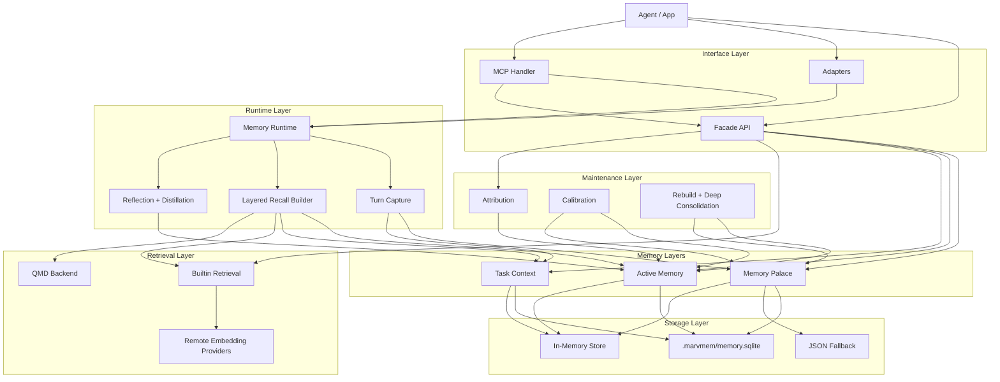
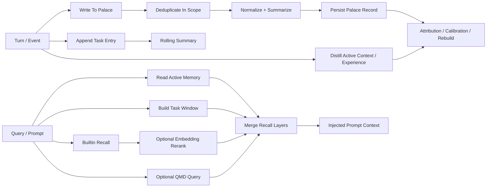

# MarvMem

MarvMem is a standalone layered memory subsystem extracted from Marv and rebuilt for other agents.

It gives you:

- `Memory Palace`: full retained long-term memory
- `Active Memory`: compressed `context` and `experience`
- `Task Context`: rolling summary, recent entries, key decisions, prompt window assembly
- `Hybrid Retrieval`: builtin recall plus optional remote embeddings
- `QMD Backend`: optional external retrieval path
- `Maintenance`: attribution, calibration, rebuild, and deep consolidation
- runtime helpers, MCP tools, and thin adapters

## Highlights

- SQLite-backed storage by default
- JSON fallback storage when you want a simple file store
- In-memory storage for tests and ephemeral sessions
- Two-layer memory structure: palace + active memory
- Task-context storage and prompt window assembly
- Weighted search using lexical overlap, local hash similarity, recency, importance, and scope
- Optional remote embedding reranking with OpenAI, Gemini, and Voyage
- Optional QMD retrieval backend
- Experience attribution, calibration, rebuild, and deep consolidation flows
- Automatic deduplication for near-identical writes
- Prompt-ready recall formatting with output length control
- MCP tools for palace, active, task, retrieval, and maintenance operations

## Package Layout

MarvMem is split into six layers:

1. `core`: palace memory records, scopes, storage, search, recall
2. `active`: compressed context and experience documents
3. `task`: task-local state, entries, decisions, and window building
4. `retrieval`: builtin recall, remote embeddings, and QMD backend
5. `maintenance`: attribution, calibration, rebuild, deep consolidation
6. `runtime`, `mcp`, and `adapters`: orchestration and integration surfaces

Available entrypoints:

- `marvmem`
- `marvmem/core`
- `marvmem/active`
- `marvmem/task`
- `marvmem/retrieval`
- `marvmem/maintenance`
- `marvmem/runtime`
- `marvmem/mcp`
- `marvmem/adapters`
- `marvmem/system`
- `marvmem/adapters/hermes-agent`
- `marvmem/adapters/openclaw`
- `marvmem/adapters/marv`

## Architecture



This is the package-level layered structure:

- interface layer: facade API, adapters, and MCP entrypoints
- runtime layer: layered recall and capture orchestration
- memory layers: palace, active memory, and task context
- retrieval layer: builtin recall, remote embeddings, and QMD
- maintenance layer: attribution, calibration, rebuild, deep consolidation
- storage layer: SQLite by default, plus JSON and in-memory fallbacks

### Memory Processing Flow



This is the memory processing path:

- write path: capture durable facts into the palace, task-local turns into task context, and compressed summaries into active memory
- retrieval path: combine active memory, task window, builtin recall, and optional QMD results
- maintenance path: attribute which experience entries were used, then calibrate or rebuild them over time

## Requirements

- Node.js `>= 22.13.0`
- ESM environment

## Install And Build

```bash
npm install
npm run build
```

For local verification:

```bash
npm run check
npm test
```

## Quick Start

```ts
import { createMarvMem } from "marvmem";
import { createMemoryRuntime } from "marvmem/runtime";

const memory = createMarvMem({
  storage: { backend: "sqlite", path: ".marvmem/memory.sqlite" },
  inferencer: async ({ kind, prompt }) => ({
    ok: true,
    text: `${kind}: ${prompt.slice(0, 200)}`,
  }),
  retrieval: {
    backend: "builtin",
    embeddings: { provider: "openai" },
  },
});

const runtime = createMemoryRuntime({
  memory,
  defaultScopes: [
    { type: "agent", id: "assistant", weight: 1 },
    { type: "user", id: "alice", weight: 1.05 },
  ],
});

await runtime.captureTurn({
  taskId: "reply-style",
  taskTitle: "Reply style guidance",
  userMessage: "Remember that I prefer concise Chinese replies.",
  scopes: [{ type: "user", id: "alice", weight: 1.05 }],
});

const recall = await runtime.buildRecallContext({
  taskId: "reply-style",
  userMessage: "How should I answer this user?",
  maxChars: 800,
});

console.log(recall.injectedContext);
```

## Core Concepts

### Memory Scopes

Every record belongs to a scope:

- `agent`
- `session`
- `user`
- `task`
- `document`

Example:

```ts
const scope = { type: "user", id: "alice", weight: 1.05 };
```

`weight` is optional and is only used when ranking scoped search results.

### Memory Records

A memory record stores:

- `id`
- `scope`
- `kind`
- `content`
- `summary`
- `confidence`
- `importance`
- `source`
- `tags`
- `metadata`
- `createdAt`
- `updatedAt`

## Core API

### Create A Memory Store

```ts
import { createMarvMem } from "marvmem";

const memory = createMarvMem({
  storage: { backend: "sqlite", path: ".marvmem/memory.sqlite" },
  dedupeThreshold: 0.85,
});
```

Options:

- `storage`: choose `sqlite`, `json`, or `memory`
- `storagePath`: shorthand storage path, still supported for quick setup
- `store`: custom storage implementation
- `idFactory`: custom ID generator
- `now`: inject a clock for testing
- `inferencer`: optional LLM compressor for active memory and maintenance flows
- `retrieval`: builtin or QMD retrieval config, plus optional remote embeddings
- `active`: active context and experience size controls
- `task`: task window and rolling-summary controls
- `embeddingDimensions`: hash-vector size, default `128`
- `dedupeThreshold`: merge near-identical writes when similarity reaches this threshold
- `searchWeights`: override ranking weights

### Write A Memory

```ts
await memory.remember({
  scope: { type: "user", id: "alice" },
  kind: "preference",
  content: "User prefers concise replies in Chinese.",
  importance: 0.9,
  tags: ["language", "style"],
  source: "manual",
});
```

### Search Memories

```ts
const hits = await memory.search("reply language preference", {
  scopes: [{ type: "user", id: "alice", weight: 1.05 }],
  maxResults: 5,
});

for (const hit of hits) {
  console.log(hit.score, hit.record.content, hit.reasons);
}
```

Each hit includes:

- `record`
- `score`
- `reasons.lexical`
- `reasons.hash`
- `reasons.recency`
- `reasons.importance`
- `reasons.scope`
- `snippet`

### Recall Prompt Context

```ts
const recall = await memory.recall({
  query: "How should I answer this user?",
  recentMessages: [
    "We were discussing answer style.",
    "The user asked for a short response.",
  ],
  scopes: [{ type: "user", id: "alice", weight: 1.05 }],
  maxChars: 1000,
});

console.log(recall.query);
console.log(recall.injectedContext);
```

### Read, List, Update, And Delete

```ts
const record = await memory.get("memory-id");

const records = await memory.list({
  scopes: [{ type: "user", id: "alice" }],
  limit: 20,
});

const updated = await memory.update("memory-id", {
  content: "User prefers concise replies in Chinese.",
  importance: 1,
});

const deleted = await memory.forget("memory-id");
```

## Runtime API

`createMemoryRuntime()` adds layered recall and capture flows on top of the core store.

```ts
import { createMemoryRuntime } from "marvmem/runtime";

const runtime = createMemoryRuntime({
  memory,
  defaultScopes: [{ type: "task", id: "support-bot", weight: 1 }],
  maxRecallChars: 1200,
});
```

### `buildRecallContext()`

Builds prompt-ready layered recall text from active memory, task context, and palace retrieval.

```ts
const recall = await runtime.buildRecallContext({
  userMessage: "What did we decide about deployment?",
  recentMessages: ["We were comparing Fly.io and Railway."],
  maxChars: 600,
});
```

### `captureTurn()`

Infers durable memories from a user turn, updates task context, and refreshes active context.

```ts
const capture = await runtime.captureTurn({
  taskId: "shipping",
  userMessage: "Remember that I prefer concise Chinese replies.",
});

console.log(capture.proposals);
console.log(capture.stored);
```

Current heuristics infer memories for:

- explicit remember requests
- preferences
- decisions
- identity statements

### `captureReflection()`

Stores a reflection as palace `experience`, distills active experience, and can record a task decision.

```ts
await runtime.captureReflection({
  summary: "We decided the adapter API should stay framework-agnostic.",
  scopes: [{ type: "task", id: "marvmem" }],
  taskId: "shipping",
  tags: ["design"],
});
```

## Layered Memory API

### Active Memory

```ts
await memory.active.distillContext({
  scope: { type: "task", id: "shipping" },
  sessionSummary: "We are preparing release notes and QA handoff.",
});

await memory.active.distillExperience({
  scope: { type: "task", id: "shipping" },
  newData: "Prefer concise release checklists with only actionable items.",
});
```

### Task Context

```ts
await memory.task.create({
  taskId: "shipping",
  scope: { type: "task", id: "shipping" },
  title: "Shipping flow",
});

await memory.task.appendEntry({
  taskId: "shipping",
  role: "user",
  content: "We still need a final QA checklist.",
});

await memory.task.addDecision({
  taskId: "shipping",
  content: "Keep the checklist short and action-oriented.",
});

const window = await memory.task.buildWindow({
  taskId: "shipping",
  currentQuery: "What is left before release?",
});
```

### Retrieval

```ts
const retrieval = await memory.retrieval.recall("release checklist", {
  scopes: [{ type: "task", id: "shipping" }],
  maxChars: 1200,
});
```

### Maintenance

```ts
await memory.maintenance.attributeExperience({
  scope: { type: "task", id: "shipping" },
  response: "I will keep the checklist concise and actionable.",
  outcome: "positive",
});

await memory.maintenance.calibrateExperience({
  scope: { type: "task", id: "shipping" },
});
```

## MCP API

`createMemoryMcpHandler()` exposes a small JSON-RPC handler with MCP-compatible tool methods.

```ts
import { createMemoryMcpHandler } from "marvmem/mcp";

const handler = createMemoryMcpHandler({ memory });
```

Supported methods:

- `initialize`
- `notifications/initialized`
- `ping`
- `tools/list`
- `tools/call`

Available tools:

- `memory_search`
- `memory_get`
- `memory_list`
- `memory_write`
- `memory_update`
- `memory_delete`
- `memory_recall`
- `memory_retrieve`
- `memory_active_get`
- `memory_active_distill`
- `memory_task_append`
- `memory_task_window`
- `memory_maintenance_calibrate`
- `memory_maintenance_rebuild`

Example `tools/call` request:

```ts
const response = await handler.handleRequest({
  jsonrpc: "2.0",
  id: 1,
  method: "tools/call",
  params: {
    name: "memory_write",
    arguments: {
      content: "User prefers concise Chinese replies.",
      kind: "preference",
      scopeType: "user",
      scopeId: "alice",
      importance: 0.9,
    },
  },
});
```

`memory_recall` accepts:

- `message`
- `recentMessages`
- `scopeType`
- `scopeId`
- `maxChars`

`memory_retrieve` runs the configured retrieval stack, including optional remote embeddings and QMD.

## Adapters

The adapter layer wraps the runtime into a small framework-friendly shape:

- `tools`
- `beforePrompt()`
- `afterTurn()`

### Hermes Agent Adapter

```ts
import { createMarvMem } from "marvmem";
import { createHermesAgentMemoryAdapter } from "marvmem/adapters/hermes-agent";

const memory = createMarvMem({ storage: { backend: "sqlite", path: ".marvmem/memory.sqlite" } });
const adapter = createHermesAgentMemoryAdapter({
  memory,
  defaultScopes: [{ type: "agent", id: "hermes", weight: 1 }],
});

const promptMemory = await adapter.beforePrompt({
  userMessage: "What did we decide about deployment?",
});

const systemPrompt = [promptMemory.systemHint, promptMemory.injectedContext]
  .filter(Boolean)
  .join("\n\n");
```

### OpenClaw Adapter

```ts
import { createMarvMem } from "marvmem";
import { createOpenClawMemoryAdapter } from "marvmem/adapters/openclaw";

const memory = createMarvMem({ storage: { backend: "sqlite", path: ".marvmem/memory.sqlite" } });
const adapter = createOpenClawMemoryAdapter({
  memory,
  defaultScopes: [{ type: "task", id: "agent-loop", weight: 1 }],
});

await adapter.afterTurn({
  userMessage: "Remember that we should keep the API easy to integrate.",
});
```

### Marv Adapter

```ts
import { createMarvMemoryAdapter } from "marvmem/adapters/marv";

const adapter = createMarvMemoryAdapter({
  memory,
  defaultScopes: [{ type: "task", id: "marv", weight: 1 }],
});
```

## Storage

By default, MarvMem uses a SQLite store at `.marvmem/memory.sqlite`.

If you want the old simple file model, you can still force JSON:

```ts
const memory = createMarvMem({
  storage: { backend: "json", path: ".marvmem/memory.json" },
});
```

For tests or temporary sessions, use the in-memory store:

```ts
import { createMarvMem, InMemoryStore } from "marvmem";

const memory = createMarvMem({
  store: new InMemoryStore(),
});
```

You can also provide your own `MemoryStore` with `load()` and `save()`.

## Development

```bash
npm install
npm run check
npm run build
npm test
```

## Limitations

- Palace storage is still exposed through the simple `MemoryStore` CRUD surface, not a fully specialized SQL query layer.
- Builtin retrieval still starts from deterministic local scoring and adds remote reranking only when configured.
- QMD integration assumes the `qmd` CLI is installed and reachable when that backend is enabled.
- Runtime capture is heuristic and intentionally simple.
- Adapters are intentionally thin because upstream agent APIs may evolve.

## Usage Guide

See [docs/USAGE.md](https://github.com/daisyluvr42/marvmem/blob/main/docs/USAGE.md) for a step-by-step usage guide.
