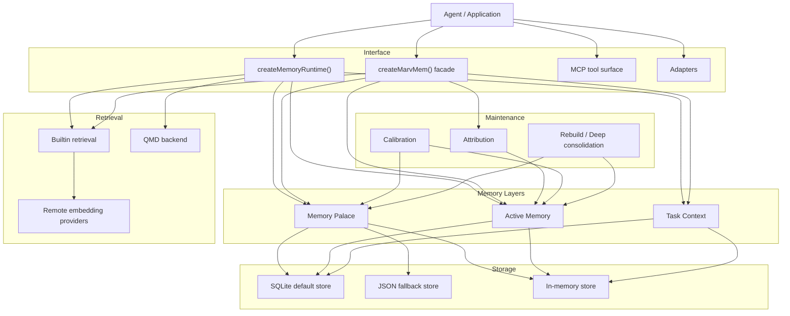
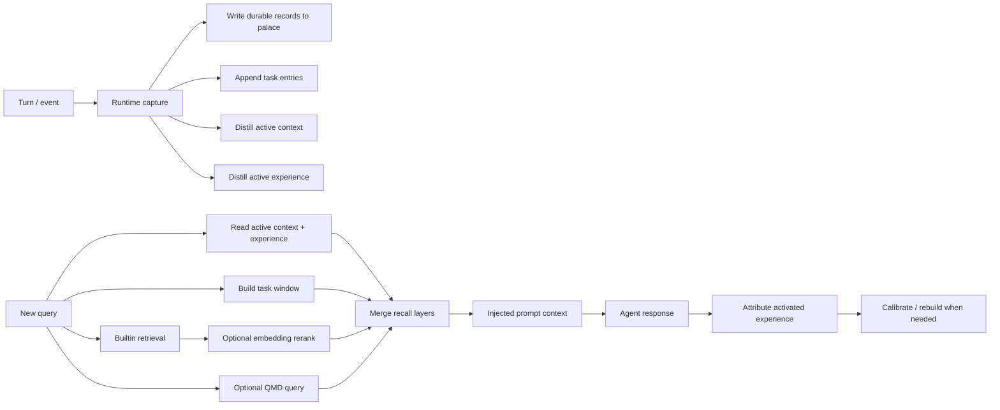

# MarvMem

MarvMem is a standalone layered memory subsystem extracted from Marv and rebuilt for other agents.

It is not just a long-term memory table. It combines:

- `Memory Palace`: full retained long-term memory
- `Active Memory`: compressed `context` and `experience`
- `Task Context`: rolling summaries, recent entries, key decisions, prompt windows
- `Retrieval`: builtin recall, optional remote embedding rerank, optional QMD backend
- `Maintenance`: attribution, calibration, rebuild, deep consolidation
- `Runtime`: turn capture and layered recall orchestration

## Why It Exists

Most agent memory libraries only keep one layer:

- either full history
- or one compressed summary

MarvMem keeps the separation that made Marv's memory system distinctive:

- keep the full durable memory in the palace
- keep a compressed active layer for what matters right now
- keep task-local working memory separate from both

That gives you a system that is easier to retrieve from, easier to inject into prompts, and easier to maintain over time.

## Highlights

- SQLite-backed storage by default
- JSON fallback store for simple deployments
- In-memory store for tests and ephemeral sessions
- Scope-aware memory records
- Active memory split into `context` and `experience`
- Task-context entries, rolling summary, and key decisions
- Builtin weighted retrieval with lexical, hash, recency, importance, and scope scoring
- Optional remote embedding reranking with OpenAI, Gemini, and Voyage
- Optional QMD retrieval backend
- Experience attribution, calibration, rebuild, and deep consolidation flows
- MCP tools and thin adapters for agent integration

## Package Layout

Main entrypoints:

- `marvmem`
- `marvmem/core`
- `marvmem/active`
- `marvmem/task`
- `marvmem/retrieval`
- `marvmem/maintenance`
- `marvmem/runtime`
- `marvmem/mcp`
- `marvmem/adapters`
- `marvmem/system`

Subsystem layout:

1. `core`
   Palace records, storage, search, recall, dedupe
2. `active`
   Compressed `context` and `experience`
3. `task`
   Task entries, rolling summary, decisions, window builder
4. `retrieval`
   Builtin retrieval, embedding providers, QMD backend
5. `maintenance`
   Attribution, calibration, rebuild, deep consolidation
6. `runtime`
   Capture turns, capture reflection, build layered recall

## Architecture

### Layered Subsystem



### Recall And Maintenance Flow



## Requirements

- Node.js `>= 22.13.0`
- ESM environment

## Install

```bash
npm install
npm run build
```

Verification:

```bash
npm run check
npm test
```

## Quick Start

```ts
import { createMarvMem } from "marvmem";
import { createMemoryRuntime } from "marvmem/runtime";

const memory = createMarvMem({
  storage: { backend: "sqlite", path: ".marvmem/memory.sqlite" },
  inferencer: async ({ kind, prompt }) => ({
    ok: true,
    text: `${kind}: ${prompt.slice(0, 200)}`,
  }),
  retrieval: {
    backend: "builtin",
    embeddings: { provider: "openai" },
  },
});

const runtime = createMemoryRuntime({
  memory,
  defaultScopes: [{ type: "user", id: "alice", weight: 1.05 }],
});

await runtime.captureTurn({
  taskId: "reply-style",
  taskTitle: "Reply style guidance",
  userMessage: "Remember that I prefer concise Chinese replies.",
});

const recall = await runtime.buildRecallContext({
  taskId: "reply-style",
  userMessage: "How should I answer this user?",
  maxChars: 800,
});

console.log(recall.injectedContext);
```

## Core Model

Every palace record has:

- `scope`
- `kind`
- `content`
- `summary`
- `confidence`
- `importance`
- `source`
- `tags`
- `metadata`

Supported scope types:

- `agent`
- `session`
- `user`
- `task`
- `document`

`weight` on a requested scope is optional and only affects ranking.

## Main APIs

### Palace

```ts
await memory.remember({
  scope: { type: "user", id: "alice" },
  kind: "preference",
  content: "User prefers concise replies in Chinese.",
  importance: 0.9,
});

const hits = await memory.search("reply style", {
  scopes: [{ type: "user", id: "alice", weight: 1.05 }],
});

const recall = await memory.recall({
  query: "How should I answer this user?",
  scopes: [{ type: "user", id: "alice", weight: 1.05 }],
  maxChars: 1000,
});
```

### Active Memory

```ts
await memory.active.distillContext({
  scope: { type: "task", id: "shipping" },
  sessionSummary: "We are preparing release notes and QA handoff.",
});

await memory.active.distillExperience({
  scope: { type: "task", id: "shipping" },
  newData: "Prefer concise release checklists with only actionable items.",
});
```

### Task Context

```ts
await memory.task.create({
  taskId: "shipping",
  scope: { type: "task", id: "shipping" },
  title: "Shipping flow",
});

await memory.task.appendEntry({
  taskId: "shipping",
  role: "user",
  content: "We still need a final QA checklist.",
});

await memory.task.addDecision({
  taskId: "shipping",
  content: "Keep the checklist short and action-oriented.",
});

const window = await memory.task.buildWindow({
  taskId: "shipping",
  currentQuery: "What is left before release?",
});
```

### Retrieval

```ts
const retrieval = await memory.retrieval.recall("release checklist", {
  scopes: [{ type: "task", id: "shipping" }],
  maxChars: 1200,
});
```

### Maintenance

```ts
await memory.maintenance.attributeExperience({
  scope: { type: "task", id: "shipping" },
  response: "I will keep the checklist concise and actionable.",
  outcome: "positive",
});

await memory.maintenance.calibrateExperience({
  scope: { type: "task", id: "shipping" },
});

await memory.maintenance.rebuildExperience({
  scope: { type: "task", id: "shipping" },
});
```

### Runtime

```ts
const runtime = createMemoryRuntime({
  memory,
  defaultScopes: [{ type: "task", id: "support-bot", weight: 1 }],
  maxRecallChars: 1200,
});

const layered = await runtime.buildRecallContext({
  taskId: "shipping",
  userMessage: "What did we decide about deployment?",
});
```

## Retrieval Backends

### Builtin

Builtin retrieval is always available. It starts with local weighted recall and can optionally rerank with remote embeddings.

Supported embedding providers:

- OpenAI
- Gemini
- Voyage

Relevant environment variables:

- `OPENAI_API_KEY`
- `GEMINI_API_KEY` or `GOOGLE_API_KEY`
- `VOYAGE_API_KEY`

### QMD

QMD is optional and requires the `qmd` CLI to be installed and reachable in the runtime environment.

Use it when you want an external indexed retrieval backend instead of, or alongside, builtin recall.

## MCP Tools

The MCP surface exposes:

- `memory_search`
- `memory_get`
- `memory_list`
- `memory_write`
- `memory_update`
- `memory_delete`
- `memory_recall`
- `memory_retrieve`
- `memory_active_get`
- `memory_active_distill`
- `memory_task_append`
- `memory_task_window`
- `memory_maintenance_calibrate`
- `memory_maintenance_rebuild`

## Storage

Default:

- SQLite at `.marvmem/memory.sqlite`

Optional:

- JSON file storage
- in-memory storage
- custom `MemoryStore`

Example JSON fallback:

```ts
const memory = createMarvMem({
  storage: { backend: "json", path: ".marvmem/memory.json" },
});
```

Example in-memory:

```ts
import { createMarvMem, InMemoryStore } from "marvmem";

const memory = createMarvMem({
  store: new InMemoryStore(),
});
```

## Current Boundaries

- Palace storage still exposes the simple `MemoryStore` surface, not a specialized SQL query API
- Builtin retrieval starts from deterministic local scoring; remote embeddings are optional rerankers
- QMD support assumes the external CLI is already available
- Turn capture is intentionally heuristic
- Adapters stay thin and framework-friendly

## Usage Guide

See [docs/USAGE.md](https://github.com/daisyluvr42/marvmem/blob/main/docs/USAGE.md) for a step-by-step integration guide.
