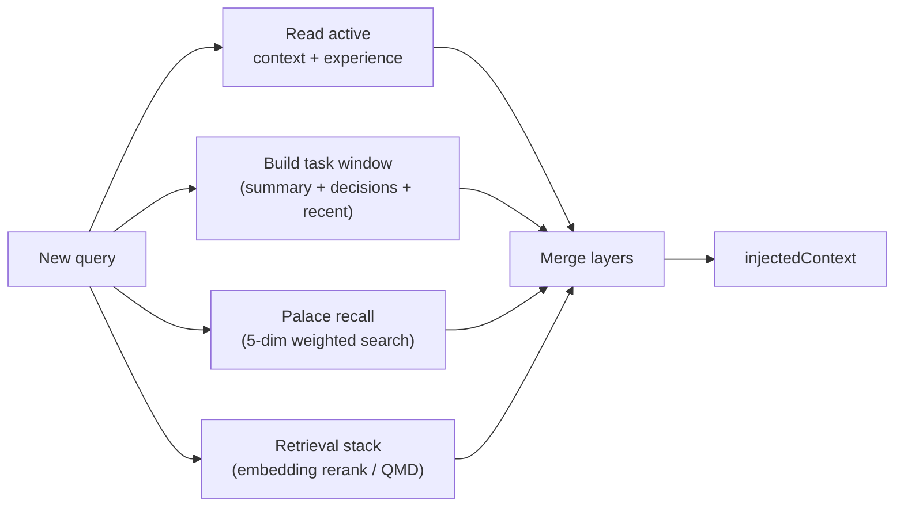
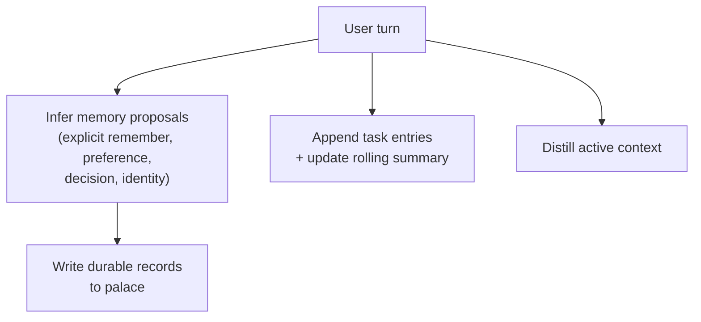

# MarvMem

Layered memory subsystem for AI agents. Extracted from Marv and rebuilt as a standalone package.

MarvMem is not a single-layer memory table. It keeps three distinct memory layers — long-term palace, compressed active memory, and task-local working memory — then orchestrates retrieval, maintenance, and lifecycle capture across all three.

## Why

Most agent memory libraries keep either a full history or a single compressed summary. MarvMem preserves the separation that made Marv's memory effective:

- **Palace** stores every durable memory record with scope, kind, confidence, importance, and tags
- **Active memory** compresses palace content into two purpose-built documents: `context` (current working state) and `experience` (reusable lessons)
- **Task context** tracks per-task entries, rolling summaries, and key decisions independent of both

This gives you a system that is easier to retrieve from, easier to inject into prompts, and easier to maintain over time.

## Highlights

- Zero external dependencies — only `node:crypto`, `node:sqlite`, `node:fs`, `node:child_process`
- SQLite-backed by default with WAL mode and FTS5 full-text search
- In-memory store for tests and ephemeral sessions
- Scope-aware records (`user` / `task` / `agent` / `session` / `document`)
- Five-dimensional weighted search scoring (lexical overlap, hash embedding, recency, importance, scope weight)
- CJK-aware tokenizer with character-level segmentation for Chinese/Japanese/Korean text
- Active memory split into `context` and `experience` with inferencer-driven distillation
- Task context with rolling summary, recent entries, key decisions, and prompt window builder
- Retrieval stack: builtin hybrid recall → optional remote embedding rerank → optional QMD backend
- Remote embedding providers: OpenAI, Gemini, Voyage
- Experience maintenance: attribution tracking, zombie entry detection, calibration, rebuild, deep consolidation
- 14 MCP tools plus a local stdio MCP server entrypoint
- Hermes bridge CLI for installing MarvMem into an existing Hermes home directory
- Thin adapters for agent framework integration
- Automatic deduplication on write (configurable similarity threshold)
- Concurrent write protection via mutation queue serialization

## Benchmarks

All numbers below are reproducible from this repository. Full methodology and per-category analysis: [`benchmarks/BENCHMARKS.md`](benchmarks/BENCHMARKS.md).

**LongMemEval — retrieval recall (500 questions, ~19k sessions):**

| Mode | R@5 | R@10 | NDCG@10 | LLM Required |
|---|---|---|---|---|
| Builtin (zero-dep) | 89.6% | 94.6% | 0.834 | None |
| + BGE-M3 (local, 1024d) | 95.8% | 97.6% | **0.915** | None |
| **+ Gemini (3072d)** | **96.2%** | **97.6%** | 0.902 | **None** |

**LoCoMo — retrieval recall (1986 QA pairs, 10 conversations):**

| Mode | R@5 | R@10 | NDCG@10 | LLM Required |
|---|---|---|---|---|
| Builtin (zero-dep) | 84.1% | 92.0% | 0.733 | None |
| **+ BGE-M3 (local, 1024d)** | **88.3%** | **94.8%** | **0.789** | **None** |
| + Gemini (3072d) | 87.6% | 94.2% | 0.775 | None |

Builtin mode uses only the built-in FNV-1a hash embedding and five-dimensional weighted scoring — zero external dependencies, zero API calls, 24 seconds total. Hybrid mode adds an embedding rerank signal (35% weight) on top of the builtin scores. BGE-M3 runs locally; Gemini runs via API.

**Reproducing every result:**

```bash
npm run build
# download datasets (see benchmarks/BENCHMARKS.md for URLs)
npm run bench:lme      # Builtin — ~14 seconds
npm run bench:locomo   # Builtin — ~10 seconds

# With local embedding (requires OpenAI-compatible embedding server)
node --experimental-strip-types benchmarks/longmemeval/bench.ts \
  --embed-url http://127.0.0.1:1234 --embed-model text-embedding-bge-m3

# With Gemini embedding (requires API key)
node --experimental-strip-types benchmarks/longmemeval/bench.ts \
  --embed-provider gemini --embed-key YOUR_GEMINI_API_KEY
```


## Requirements

- Node.js `>= 22.13.0` (uses `node:sqlite` built-in)
- ESM environment

## Install

```bash
npm install
npm run build
```

Build outputs include:

- `dist/bin/marvmem-mcp.js` for MCP clients like Codex or Claude Code
- `dist/bin/marvmem-hermes.js` for wiring MarvMem into an existing Hermes install

Verify:

```bash
npm run check   # TypeScript type check
npm test
```

## Quick Start

```ts
import { createMarvMem } from "marvmem";
import { createMemoryRuntime } from "marvmem/runtime";

const memory = createMarvMem({
  storage: { backend: "sqlite", path: ".marvmem/memory.sqlite" },
  inferencer: async ({ kind, system, prompt }) => ({
    ok: true,
    text: `${kind}: ${prompt.slice(0, 200)}`,
  }),
});

const runtime = createMemoryRuntime({
  memory,
  defaultScopes: [{ type: "user", id: "alice", weight: 1.05 }],
});

// Capture a turn — writes palace records, task entries, distills active context
await runtime.captureTurn({
  taskId: "reply-style",
  taskTitle: "Reply style guidance",
  userMessage: "Remember that I prefer concise Chinese replies.",
});

// Build layered recall — merges active + task + palace + retrieval layers
const recall = await runtime.buildRecallContext({
  taskId: "reply-style",
  userMessage: "How should I answer this user?",
  maxChars: 800,
});

console.log(recall.injectedContext);
```

## Architecture

### Module Structure

```
src/
├── core/              Palace: CRUD, search, recall, dedup, storage
│   ├── memory.ts      MarvMem class (483 lines)
│   ├── storage.ts     SqliteMemoryStore + InMemoryStore
│   ├── types.ts       MemoryRecord, MemoryScope, MemoryStore interface
│   ├── hash-embedding.ts   FNV-1a hash-based embedding (128-dim default)
│   └── tokenize.ts    CJK-aware tokenizer
├── active/            Active memory: context + experience distillation
│   ├── manager.ts     ActiveMemoryManager
│   ├── store.ts       SqliteActiveMemoryStore + InMemoryActiveMemoryStore
│   └── types.ts       ActiveMemoryDocument, ActiveMemoryStore interface
├── task/              Task context: entries, summary, decisions, windows
│   ├── manager.ts     TaskContextManager
│   ├── store.ts       SqliteTaskContextStore + InMemoryTaskContextStore (506 lines)
│   └── types.ts       TaskContextRecord, TaskContextEntry, TaskContextWindow
├── retrieval/         Retrieval orchestration
│   ├── manager.ts     RetrievalManager (builtin + QMD)
│   ├── embeddings.ts  OpenAI / Gemini / Voyage / Hash providers
│   ├── qmd.ts         QMD CLI backend
│   └── types.ts       RetrievalHit, MemoryEmbeddingProvider interface
├── maintenance/       Experience maintenance
│   ├── manager.ts     Attribution, calibration, rebuild, deep consolidation (438 lines)
│   └── types.ts       ExperienceEntryStat, calibration/rebuild result types
├── runtime/           Lifecycle orchestration
│   ├── runtime.ts     captureTurn, captureReflection, buildRecallContext
│   └── types.ts       MemoryRuntime interface, MemoryTurnInput
├── mcp/               MCP tool surface (JSON-RPC 2.0)
│   ├── handler.ts     14 tools + JSON-RPC handler
│   └── stdio.ts       Local stdio server runner
├── bin/               Executable entrypoints
│   ├── marvmem-mcp.ts     Local MCP server CLI
│   └── marvmem-hermes.ts  Hermes bridge + plugin installer
├── adapters/          Agent framework adapters
│   ├── base.ts        GenericMemoryAdapter (beforePrompt / afterTurn / tools)
│   ├── openclaw.ts    OpenClaw adapter
│   ├── hermes-agent.ts  Hermes adapter
│   └── marv.ts        Marv compatibility adapter
├── system/            Infrastructure
│   ├── types.ts       MemoryInferencer, embedding/QMD config types
│   └── sqlite.ts      Schema bootstrap (7 tables, 3 indexes, 1 FTS5 virtual table)
└── index.ts           Package re-exports
```

### Layered Recall Flow



### Turn Capture Flow



## SQLite Schema

Default database path: `.marvmem/memory.sqlite`

| Table | Purpose |
|-------|---------|
| `memory_items` | Palace records (id, scope, kind, content, summary, confidence, importance, tags, timestamps) |
| `memory_items_fts` | FTS5 full-text index on memory items |
| `active_documents` | Active context + experience documents (kind × scope composite key) |
| `task_context` | Task metadata (task_id, scope, title, status) |
| `task_context_entries` | Task conversation entries with sequence ordering |
| `task_context_state` | Rolling summary per task |
| `task_context_bookmarks` | Key decisions and bookmarks per task |

All tables are created automatically on first connection. WAL mode and foreign keys are enabled by default.

## Core APIs

### Palace

```ts
// Write (auto-deduplicates against existing records with >0.85 similarity)
const record = await memory.remember({
  scope: { type: "user", id: "alice" },
  kind: "preference",
  content: "User prefers concise replies in Chinese.",
  importance: 0.9,
  tags: ["language", "style"],
});

// Search (5-dimensional scoring: lexical, hash, recency, importance, scope)
const hits = await memory.search("reply style", {
  scopes: [{ type: "user", id: "alice", weight: 1.05 }],
  maxResults: 5,
  minScore: 0.18,
});

// Prompt-ready recall
const recall = await memory.recall({
  query: "How should I answer this user?",
  scopes: [{ type: "user", id: "alice", weight: 1.05 }],
  maxChars: 1000,
});

// Update / Delete
await memory.update(record.id, { content: "Updated content" });
await memory.forget(record.id);
```

### Active Memory

```ts
// Distill current working context
await memory.active.distillContext({
  scope: { type: "task", id: "release-flow" },
  sessionSummary: "We are preparing release notes and QA handoff.",
});

// Distill reusable experience
await memory.active.distillExperience({
  scope: { type: "task", id: "release-flow" },
  newData: "Release checklists should be short and action-oriented.",
});

// Read
const ctx = await memory.active.read("context", { type: "task", id: "release-flow" });
const exp = await memory.active.read("experience", { type: "task", id: "release-flow" });
```

### Task Context

```ts
// Create task
await memory.task.create({
  taskId: "release-flow",
  scope: { type: "task", id: "release-flow" },
  title: "Release flow",
});

// Append entries
await memory.task.appendEntry({
  taskId: "release-flow",
  role: "user",
  content: "We still need a final QA checklist.",
});

// Record key decisions
await memory.task.addDecision({
  taskId: "release-flow",
  content: "Keep the checklist short and action-oriented.",
});

// Build prompt-ready task window
const window = await memory.task.buildWindow({
  taskId: "release-flow",
  currentQuery: "What is left before release?",
  maxChars: 2000,
});
// window.injectedContext contains: rolling summary + key decisions + recent entries
// window.charUsage tracks budget allocation per section
```

### Retrieval

```ts
// Builtin hybrid recall (optionally with remote embedding rerank)
const result = await memory.retrieval.recall("release checklist", {
  scopes: [{ type: "task", id: "release-flow" }],
  maxChars: 1200,
});
```

### Maintenance

```ts
// Attribution — track which experience entries influenced a response
await memory.maintenance.attributeExperience({
  scope: { type: "task", id: "release-flow" },
  response: "I will keep the checklist concise and actionable.",
  outcome: "positive",
});

// Calibration — detect zombie/harmful entries, remove stale experience
const cal = await memory.maintenance.calibrateExperience({
  scope: { type: "task", id: "release-flow" },
});
// cal.zombieRemoved, cal.harmfulFlagged, cal.coreConfirmed

// Rebuild — regenerate experience from recent palace fragments
await memory.maintenance.rebuildExperience({
  scope: { type: "task", id: "release-flow" },
});

// Deep consolidation — rebuild then calibrate in sequence
await memory.maintenance.deepConsolidate({
  scope: { type: "task", id: "release-flow" },
});
```

### Runtime

```ts
const runtime = createMemoryRuntime({
  memory,
  defaultScopes: [{ type: "user", id: "alice", weight: 1.05 }],
  maxRecallChars: 1200,
});

// Capture turn — infers durable memories, writes palace + task, distills active context
const capture = await runtime.captureTurn({
  taskId: "release-flow",
  taskTitle: "Release flow",
  userMessage: "Remember that I prefer concise Chinese replies.",
  assistantMessage: "Got it, I'll keep replies concise and in Chinese.",
});
// capture.proposals — inferred memory proposals (explicit remember, preference, decision, identity)
// capture.stored — records actually written to palace
// capture.taskEntries — entries appended to task context

// Layered recall — merges active + task + palace + retrieval layers
const recall = await runtime.buildRecallContext({
  taskId: "release-flow",
  userMessage: "What did we decide about deployment?",
  maxChars: 1000,
});
// recall.injectedContext — ready to inject into system prompt
// recall.layers.active, recall.layers.task, recall.layers.palace, recall.layers.retrieval

// Reflection — write structured experience + palace record
await runtime.captureReflection({
  taskId: "release-flow",
  summary: "Adapter APIs should remain framework-agnostic.",
  scopes: [{ type: "task", id: "release-flow" }],
});

// System hint for agent instructions
const hint = runtime.buildSystemHint();
```

## Retrieval Backends

### Builtin (default)

Always available. Starts with local five-dimensional weighted scoring:

| Factor | Default Weight | Description |
|--------|---------------|-------------|
| Lexical overlap | 0.45 | Token overlap between query and record |
| Hash embedding | 0.35 | FNV-1a hash-based 128-dim cosine similarity |
| Recency | 0.08 | Time decay: `1 / (1 + ageDays / 30)` |
| Importance | 0.07 | Record importance score (0–1) |
| Scope weight | 0.05 | Requested scope weight factor |

Optionally adds remote embedding reranking (blended 65% builtin / 35% vector score).

### Remote Embedding Providers

| Provider | Env Variable | Default Model |
|----------|-------------|---------------|
| OpenAI | `OPENAI_API_KEY` | `text-embedding-3-small` |
| Gemini | `GEMINI_API_KEY` or `GOOGLE_API_KEY` | `gemini-embedding-001` |
| Voyage | `VOYAGE_API_KEY` | `voyage-4` |

```ts
const memory = createMarvMem({
  retrieval: {
    backend: "builtin",
    embeddings: { provider: "openai" },  // or "gemini", "voyage", "auto"
  },
});
```

### QMD Backend

Optional external indexed retrieval via `qmd` CLI:

```ts
const memory = createMarvMem({
  retrieval: {
    backend: "qmd",
    qmd: {
      enabled: true,
      command: "qmd",
      collections: [{ name: "memory", path: ".marvmem/qmd", pattern: "**/*.md" }],
      includeDefaultMemory: true,
    },
  },
});
```

## MCP Tools

For custom hosts, `createMemoryMcpHandler()` exposes 14 tools via JSON-RPC 2.0:

| Tool | Description |
|------|-------------|
| `memory_search` | Search palace records by query with scope filtering |
| `memory_get` | Fetch one record by id |
| `memory_list` | List records, optionally filtered by scope |
| `memory_write` | Persist a durable record (auto-deduplicates) |
| `memory_update` | Update an existing record by id |
| `memory_delete` | Delete a record by id |
| `memory_recall` | Build prompt-ready recall from palace |
| `memory_retrieve` | Run full retrieval stack (embeddings + QMD) |
| `memory_active_get` | Read active context + experience for a scope |
| `memory_active_distill` | Distill active context or experience |
| `memory_task_append` | Append entry to task context (auto-creates task) |
| `memory_task_window` | Build prompt-ready task context window |
| `memory_maintenance_calibrate` | Run experience calibration |
| `memory_maintenance_rebuild` | Rebuild experience from palace fragments |

```ts
import { createMemoryMcpHandler } from "marvmem/mcp";

const handler = createMemoryMcpHandler({ memory });
const response = await handler.handleRequest(jsonRpcPayload);
```

For a production local MCP server, build the repo and run the bundled stdio entrypoint:

```bash
npm run build
node dist/bin/marvmem-mcp.js
```

Defaults:

- storage path: `~/.marvmem/memory.sqlite`
- retrieval backend: builtin
- remote embeddings: disabled unless explicitly configured

Useful overrides:

```bash
MARVMEM_SCOPE_TYPE=agent \
MARVMEM_SCOPE_ID=codex \
MARVMEM_STORAGE_PATH="$HOME/.marvmem/memory.sqlite" \
node dist/bin/marvmem-mcp.js
```

Register it with Codex:

```bash
codex mcp add marvmem \
  --env MARVMEM_SCOPE_TYPE=agent \
  --env MARVMEM_SCOPE_ID=codex \
  -- node /absolute/path/to/marvmem/dist/bin/marvmem-mcp.js
```

If the current Codex session does not pick up the new server immediately, start a new session after adding it.

Register it with Claude Code:

```bash
claude mcp add-json -s project marvmem '{"type":"stdio","command":"node","args":["/absolute/path/to/marvmem/dist/bin/marvmem-mcp.js"],"env":{"MARVMEM_SCOPE_TYPE":"agent","MARVMEM_SCOPE_ID":"claude"}}'
```

This writes a project-scoped `.mcp.json`. You can verify the server is connected with `claude mcp get marvmem`.

## Adapters

Generic adapters translate host events into lifecycle calls:

```ts
import { createGenericMemoryAdapter } from "marvmem/adapters";

const adapter = createGenericMemoryAdapter({ memory });

// Before generating a response
const { systemHint, injectedContext } = await adapter.beforePrompt({
  userMessage: "How should I deploy this?",
});

// After a response is generated
await adapter.afterTurn({
  userMessage: "How should I deploy this?",
  assistantMessage: "I recommend using Railway for this project.",
});

// adapter.tools — array of MCP tool definitions for direct integration
```

Pre-built adapters:

| Adapter | Factory |
|---------|---------|
| Generic | `createGenericMemoryAdapter()` |
| OpenClaw | `createOpenClawMemoryAdapter()` |
| Hermes | `createHermesAgentMemoryAdapter()` |
| Marv | `createMarvMemoryAdapter()` |

`createHermesAgentMemoryAdapter()` and `createOpenClawMemoryAdapter()` are meant for hosts that already keep memory in markdown files.

They do four things:

- default to session-flush capture
- import existing markdown memory files during setup
- let MarvMem manage the memory state
- write the host markdown files back after changes so the original prompt path can keep using them

Hermes example:

```ts
import { createMarvMem } from "marvmem";
import { installHermesAgentMemoryTakeover } from "marvmem/adapters";

const memory = createMarvMem({
  storage: { backend: "sqlite", path: "~/.marvmem/memory.sqlite" },
  inferencer: async ({ kind, prompt }) => ({ ok: true, text: `${kind}: ${prompt}` }),
});

const { adapter, imported } = await installHermesAgentMemoryTakeover({
  memory,
  defaultScopes: [{ type: "agent", id: "hermes" }],
});

console.log(imported);
await adapter.afterTurn({
  userMessage: "Remember that I prefer concise Chinese replies.",
  assistantMessage: "I will keep responses concise.",
});
```

If you already have a real Hermes install and want a low-setup integration, you can install the bridge plugin instead of wiring the adapter by hand:

```bash
npm run build
node dist/bin/marvmem-hermes.js install-plugin \
  --hermes-home ~/.hermes \
  --storage-path ~/.hermes/marvmem.sqlite \
  --scope-type agent \
  --scope-id hermes
```

This does two things:

- imports `~/.hermes/memories/MEMORY.md` and `USER.md` into MarvMem if the SQLite store is still empty
- installs a Hermes plugin that syncs turns, built-in `memory` tool writes, and session finalization back into MarvMem

OpenClaw example:

```ts
import { createMarvMem } from "marvmem";
import { installOpenClawMemoryTakeover } from "marvmem/adapters";

const memory = createMarvMem({
  storage: { backend: "sqlite", path: "~/.marvmem/memory.sqlite" },
  inferencer: async ({ kind, prompt }) => ({ ok: true, text: `${kind}: ${prompt}` }),
});

const { adapter } = await installOpenClawMemoryTakeover({
  memory,
  defaultScopes: [{ type: "agent", id: "openclaw" }],
});

await adapter.afterTurn({
  taskTitle: "Release checklist",
  userMessage: "Remember that we use pnpm workspaces.",
  assistantMessage: "I will keep using pnpm workspaces.",
});
await adapter.flushSession();
```

If you already have a real OpenClaw install and want the low-setup path, install the bridge plugin instead:

```bash
npm run build
node dist/bin/marvmem-openclaw.js install-plugin \
  --scope-type agent \
  --scope-id openclaw
```

This does two things:

- imports `~/.openclaw/workspace/MEMORY.md`, `USER.md`, `memory/YYYY-MM-DD.md`, and `DREAMS.md` into MarvMem if the SQLite store is still empty
- installs an OpenClaw plugin that uses the official hooks to inject recall context before each turn and sync the turn back into MarvMem after the run

When the current OpenClaw session is using a normal HTTP-backed model provider, the bridge also reuses that same model for MarvMem's session summaries. You do not need to add a second MarvMem-specific LLM config just for `active` or `task` distillation.

## Storage

### SQLite (default)

```ts
const memory = createMarvMem({
  storage: { backend: "sqlite", path: ".marvmem/memory.sqlite" },
});
```

### In-Memory

For tests and ephemeral sessions:

```ts
import { createMarvMem, InMemoryStore } from "marvmem";

const memory = createMarvMem({
  store: new InMemoryStore(),
});
```

## Configuration

```ts
const memory = createMarvMem({
  // Storage
  storage: { backend: "sqlite", path: ".marvmem/memory.sqlite" },

  // Inferencer — required for distillation, calibration, rebuild
  inferencer: async ({ kind, system, prompt, maxChars }) => ({
    ok: true,
    text: "...",
  }),

  // Retrieval
  retrieval: {
    backend: "builtin",
    embeddings: { provider: "auto" },
    qmd: { enabled: false },
  },

  // Active memory limits
  active: {
    contextMaxChars: 400,
    experienceMaxChars: 800,
  },

  // Task context
  task: {
    recentEntriesLimit: 24,
    windowMaxChars: 4000,
    summaryMaxChars: 600,
  },

  // Palace tuning
  dedupeThreshold: 0.85,       // 0–1, set to 1 to disable dedup
  embeddingDimensions: 128,    // hash embedding vector size
  searchWeights: {             // override default scoring weights
    lexical: 0.45,
    hash: 0.35,
    recency: 0.08,
    importance: 0.07,
    scope: 0.05,
  },
});
```

## Package Exports

```
marvmem              — Main entry (all modules)
marvmem/core         — Palace CRUD, search, recall, storage
marvmem/active       — Active memory manager + stores
marvmem/task         — Task context manager + stores
marvmem/retrieval    — Retrieval manager + embedding providers
marvmem/maintenance  — Experience maintenance flows
marvmem/runtime      — Lifecycle runtime
marvmem/mcp          — MCP handler + stdio server helpers
marvmem/adapters     — Agent framework adapters
marvmem/system       — Types + SQLite utilities
marvmem/cloud        — Plan gates, usage, cloud sync helpers
marvmem/platform     — Project-aware memory service
marvmem/http         — Local HTTP API server
marvmem/auth         — Project API key helpers
marvmem/entity       — Entity extraction and lightweight graph storage
marvmem/inspect      — Inspect events and webhook dispatch
marvmem/bridge       — Markdown projection bridge adapters
marvmem/products/coding   — Coding-agent product surface
marvmem/products/runtime  — Runtime product surface
```

## Current Boundaries

- Palace search loads all scoped records into memory for scoring. Suitable for thousands of records; very large collections should use the retrieval stack with remote embeddings
- Builtin retrieval starts from deterministic local scoring; remote embeddings are optional rerankers
- QMD support requires the `qmd` CLI to be available in PATH
- Turn capture uses heuristic pattern matching for memory proposal inference
- Active memory still lives in SQLite only. The Hermes/OpenClaw file sync currently writes back durable memory files, not every active-memory document
- Generic adapters are intentionally thin; the Hermes/OpenClaw adapters also import existing markdown memory and write those files back after changes
- `captureOverflow` and `captureTaskOutcome` lifecycle hooks are planned but not yet implemented

## Usage Guide

See [docs/USAGE.md](docs/USAGE.md) for a step-by-step integration guide covering scope design, layer selection, and deployment patterns.

## License

Private.
