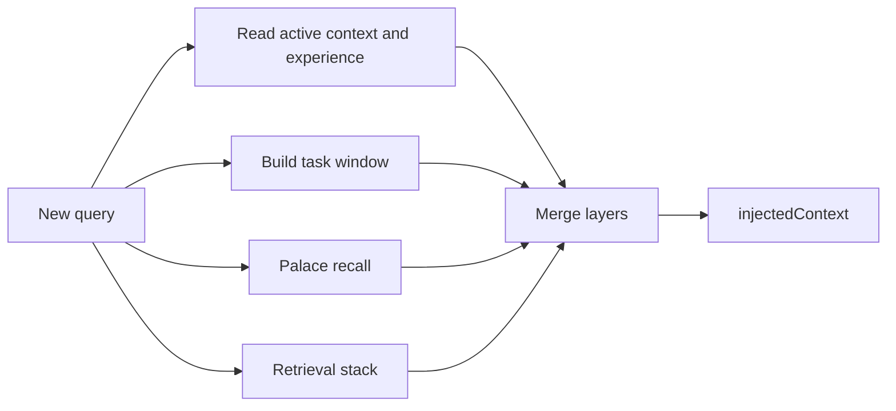
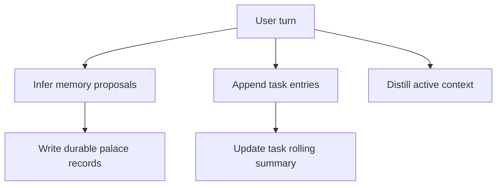

# MarvMem Architecture

MarvMem is a layered memory subsystem for AI agents. It keeps durable records, compressed working state, and task-local context separate, then composes them at recall time.

## Layers

| Layer | Purpose | Stored as |
|-------|---------|-----------|
| Palace | Durable long-term memory records | `memory_items` |
| Active memory | Compressed current context and reusable experience | `active_documents` |
| Task context | Per-task transcript entries, rolling summary, and decisions | `task_context*` tables |
| Retrieval | Optional vector / QMD retrieval on top of palace records | built-in scoring, vector store, or QMD |

## Module Structure

```text
src/
├── core/              Palace CRUD, search, recall, dedup, storage
│   ├── memory.ts      MarvMem class
│   ├── storage.ts     SqliteMemoryStore + InMemoryStore
│   ├── types.ts       MemoryRecord, MemoryScope, MemoryStore
│   ├── hash-embedding.ts
│   └── tokenize.ts
├── active/            Active context + experience distillation
├── task/              Task entries, summary, decisions, prompt windows
├── retrieval/         Builtin retrieval, remote embedding rerank, QMD
├── maintenance/       Experience attribution, calibration, rebuild
├── runtime/           Turn capture and layered recall orchestration
├── mcp/               JSON-RPC tool handler and stdio server
├── adapters/          Generic, Hermes, OpenClaw, and Marv adapters
├── bridge/            Markdown projection bridge adapters
├── platform/          Project-aware service boundary
├── http/              Local HTTP API and console routes
├── auth/              Local project API key support
├── inspect/           Event log, recall inspection, webhook dispatch
├── agents/            Local multi-agent setup manager
├── console/           Browser control plane
└── bin/               CLI entrypoints
```

## Layered Recall Flow



The recall result can expose both prompt-ready text and structured hits. MCP `memory_context` with `action: "recall"` returns compact hits by default; `verbose: true` exposes full layers, evidence, and record metadata for diagnostics.

## Turn Capture Flow



Session-flush wrappers can delay active/task distillation until the host knows the session is ending. This keeps per-turn overhead low for tool-heavy coding agents.

## SQLite Schema

Default local MCP storage path: `~/.marvmem/memory.sqlite`

| Table | Purpose |
|-------|---------|
| `memory_items` | Palace records with scope, content, compact metadata, timestamps, soft-delete provenance, and supersede relationships |
| `memory_items_fts` | FTS5 full-text index for palace records |
| `active_documents` | Active `context` and `experience` documents by scope |
| `task_context` | Task metadata |
| `task_context_entries` | Ordered task transcript entries |
| `task_context_state` | Rolling summary per task |
| `task_context_bookmarks` | Decisions and task bookmarks |
| `entities` | Lightweight entity records |
| `entity_links` | Entity to memory links |
| `entity_relations` | Entity graph edges |

The schema is created automatically on first connection. SQLite runs with WAL mode and foreign keys enabled. Oversized legacy metadata is handled by the offline `marvmem-agent migrate` command, which creates a timestamped backup before compaction and FTS rebuild.

## Scope Model

Memory records are scoped so recall can merge broad and narrow context without mixing unrelated projects.

Supported scope types:

```text
agent | session | user | task | document | project | repo
```

For project-aware platform usage, repo scope is project-qualified internally. For agent setup, MarvMem intentionally keeps MCP recall broad by default so agents can share one user memory store, while durable writes can still use `agent:<id>` scopes.

## Storage Boundaries

- Builtin palace search uses FTS5 and SQL to select visible candidates, scores only that bounded set in JavaScript, and lazily loads metadata for final hits.
- Deleted, superseded, and `workbuddy_document` anchor records are excluded at both FTS write and query time.
- Builtin hash embeddings are deterministic but not cross-language semantic embeddings; remote embeddings remain an explicit opt-in rerank layer.
- Active memory is stored in SQLite. Markdown bridge adapters mirror durable memory files for host compatibility.
- Unscoped recall can aggregate the three most recently active scopes within the final character budget.
- Generic adapters stay thin. Host-specific wrappers should reuse the host's model/provider/auth where possible.
